# 🚀 Introducing NepLoom — Curiosity Unleashed.

NepLoom is not just a platform — it's a movement.
A place where curiosity begins, and spreads.

In a world full of information overload and boring PDFs, NepLoom reimagines how we learn, share, and grow.

## 📚 What is NepLoom?
NepLoom is an Ed-tech social blogging platform where creators, called **NepLers**, craft and post blogs known as **Looms**. But these aren’t just regular blogs — they’re infused with gamified experiences and interactive learning tools.

From in-blog games like:
-   Blast 🧨
-   Match 🧩
-   Blocks 🧱
-   Quiz ❓
-   Flashcards 🃏

To profile gamification like:
-   Streaks 🔥
-   LoomCoins 💰

Learning becomes addictive — in a good way.

## 🧠 Smarter, Not Harder
NepLoom is built for active learning and retention. Each Loom can include:
-   Text-to-Speech for auditory learners 🗣️
-   Mindmaps and Notes for structured thinking 🧠
-   AI-generated summaries to save time ⏱️
-   One-click translation to break language barriers 🌐
-   A “Teach” mode so anyone can become a mentor 🧑‍🏫

It's learning made personal and powerful.

## 💻 More Than Just Blogs
NepLoom supports:
-   Articles 📄
-   Microblogs (Quicks) ⚡
-   Documentation Sharing 📚

With custom code support, NepLoom also doubles as a developer-friendly SaaS tool. Creators can:
-   Customize their blog (Loom) design 🎨
-   Customize profile layouts 🖼️
-   Embed NepLoom content on personal sites using APIs 🔗
-   Share content as public, private, or unlisted 🔒

It's your space. Your rules.

## 💸 Monetization & Rewards
NepLoom respects creators and readers alike.
There are two types of **Loomers**:
-   **Space Loomers**: Earn by watching ads 📺
-   **Time Loomers**: Skip ads, save time ⏳

Ad revenue is split transparently:
NepLoom / NepLer / Loomer → 40% / 40% / 20%

Creators (**NepLers**) can:
-   Add promotional links 📢
-   Run paid promotions for others 🤝
-   Earn badges for verified content ✅

## 🧪 What’s Next?
We’re building the future.
Soon, you’ll be able to:
-   Upload images 🖼️
-   Ask AI questions based on that content 🤖💬

Imagine asking questions to a blog as if it were a person. That’s where we’re going.

## 🌍 Our Vision
NepLoom isn’t just another blogging platform.
It’s a dream —
of making education free, fun, and for everyone.

Let’s make curiosity contagious.
Let’s build the future of learning — together.

## 🌊 Application Workflow

```mermaid
graph TD
    subgraph User Journey
        A[User/Creator] --> B{NepLoom Platform};
    end

    subgraph Content Creation & Consumption
        B --> C[Create/View Looms];
        C -- Gamification --> D[Interactive Tools: Blast, Match, Blocks, Quiz, Flashcards];
        C -- Learning Aids --> E[Text-to-Speech, Mindmaps, AI Summaries, Translation, Teach Mode];
        B --> F[Create/View Quicks - Microblogs];
        B --> G[Share/View Articles & Documentation];
    end

    subgraph Customization & Sharing
        A -- Customization --> H[Customize Loom Design];
        A -- Customization --> I[Customize Profile Layout];
        A -- Embedding --> J[Embed Content via API];
        C -- Sharing Options --> K[Public/Private/Unlisted];
    end

    subgraph Monetization & Rewards
        B -- User Type --> L{Loomer Type: Space/Time};
        L -- Space Loomer --> M[Watch Ads, Earn Rewards];
        L -- Time Loomer --> N[Skip Ads];
        M -- Ad Revenue --> O[Revenue Split: NepLoom - 40% / NepLer - 40% / Loomer - 20%];
        A -- Creator Rewards --> P[Add Promo Links, Run Paid Promotions, Earn VBadges];
    end

    subgraph Profile Gamification
        A --> Q[Engage with Platform];
        Q --> R[Earn Streaks 🔥];
        Q --> S[Earn LoomCoins 💰];
    end

    subgraph Future Enhancements
        B --> T[Image Uploads];
        B --> U[AI Q&A on Blog Content];
    end
```



## 🎬 Demonstrations


### Feature 1: Creating a Loom with Interactive Elements


### Feature 2: Engaging with Gamified Learning


### Feature 3: Profile Customization and Streaks


## 🛠️ Getting Started

Follow these instructions to get a copy of the project up and running on your local machine for development and testing purposes.

### Prerequisites

-   Node.js (v18.x or later recommended)
-   npm or yarn
-   Git

### Cloning the Project

1.  **Fork the repository** (Optional, but recommended if you plan to contribute):
    Click the "Fork" button at the top right of the main repository page on GitHub.

2.  **Clone your forked repository** (or the original repository if you are not contributing directly):
    Replace `your-username` with your GitHub username if you forked. Replace `Echoinbyte/neploom` with the actual path to the main repository if needed.
    ```bash
    # If you forked the repository:
    git clone https://github.com/your-username/neploom.git
    
    # Or, to clone the original repository directly:
    # git clone https://github.com/Echoinbyte/neploom.git
    
    cd neploom
    ```

### Installation

Install the project dependencies using npm or yarn:
```bash
npm install
# or
yarn install
```

### Running the Development Server

Start the Next.js development server:
```bash
npm run dev
# or
yarn dev
```
Open [http://localhost:3000](http://localhost:3000) (or the port indicated in your terminal) with your browser to see the result.

### Building for Production

To create a production-ready build:
```bash
npm run build
# or
yarn build
```

### Running in Production Mode

To start the server in production mode after building (this usually requires a hosting platform or a Node.js server environment):
```bash
npm start
# or
yarn start
```

## 🤝 Contributing

Contributions are what make the open-source community such an amazing place to learn, inspire, and create. Any contributions you make are **greatly appreciated**.

### Pull Request (PR) Process

1.  **Ensure your code lints and passes tests.** (Details on running linters/tests should be added here if applicable).
2.  **Update the README.md** with details of any changes to the interface, new environment variables, exposed ports, useful file locations, or container parameters if applicable.
3.  **Keep your PR focused.** Make sure your PR addresses only one issue or feature. Create separate PRs for unrelated changes.
4.  **Write clear commit messages.** Follow conventional commit message standards if the project uses them.
5.  **Request reviews.** Once your PR is ready, request a review from project maintainers or other contributors.

### Setting up your local environment for contributing:

1.  **Fork the project** (if you haven't already).
2.  **Clone your fork** to your local machine.
3.  **Create a new branch** for your feature or bug fix. It's good practice to name your branch descriptively (e.g., `feature/add-image-upload` or `fix/login-bug`).
    ```bash
    git checkout -b feature/AmazingFeature
    # or for a fix
    # git checkout -b fix/SomeBug
    ```
4.  **Make your changes.** Implement your feature or fix the bug.
5.  **Commit your changes.** Use clear and descriptive commit messages.
    ```bash
    git add .
    git commit -m 'feat: Add some AmazingFeature'
    # or for a fix
    # git commit -m 'fix: Resolve SomeBug'
    ```
6.  **Push your changes** to your forked repository on GitHub.
    ```bash
    git push origin feature/AmazingFeature
    ```
7.  **Open a Pull Request (PR).** Go to the original NepLoom repository on GitHub. You should see a prompt to create a PR from your recently pushed branch. Fill out the PR template with a clear description of your changes.

### Staying Up-to-Date with the Main Project

To keep your local fork and branches up-to-date with the main NepLoom repository (often referred to as `upstream`):

1.  **Configure an `upstream` remote** (you only need to do this once):
    ```bash
    git remote add upstream https://github.com/Echoinbyte/neploom.git 
    # Replace with the actual URL of the main NepLoom repository
    ```
2.  **Fetch changes from `upstream`**:
    ```bash
    git fetch upstream
    ```
3.  **Merge changes into your local `main` (or `master`) branch**:
    ```bash
    git checkout main
    git merge upstream/main
    ```
4.  **Update your feature branch** (optional, but good practice before pushing or creating a PR):
    ```bash
    git checkout feature/AmazingFeature
    git rebase main # or git merge main
    ```

### Coding Standards

-   Follow ESLint rules (see `eslint.config.mjs`).
-   Write clear, maintainable code.
-   ...

## 🤝 Contributors

This project is a unique collaboration between human ingenuity and artificial intelligence.

*   **Sambhav Aryal (Echoinbyte)**: Lead Developer, Project Visionary, Core Architect, and Resource collaborator.
*   **AI**: My partner in creation. The AI has been instrumental in:
    *   **Copywriting**: Generating and refining the text you're reading in this `README.md`, `JOURNEY.md` and other documents.
    *   **Asset Generation**: Creating some of the initial visual assets for the project.

We believe this human-AI partnership represents the future of creative and technical work.

## 📜 License

Distributed under the MIT License.

---

Let’s make curiosity contagious.
Let’s build the future of learning — together! 🚀